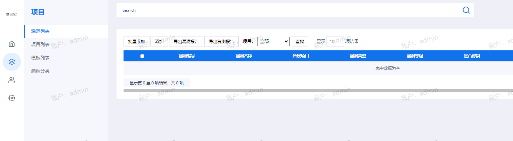
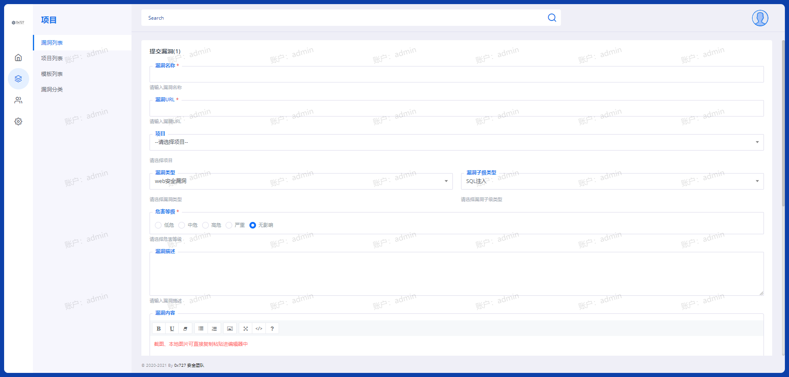
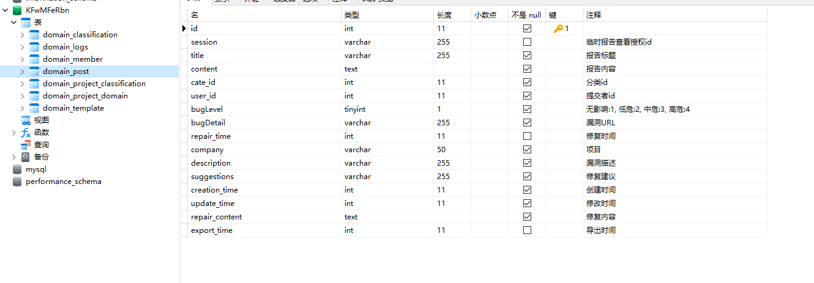
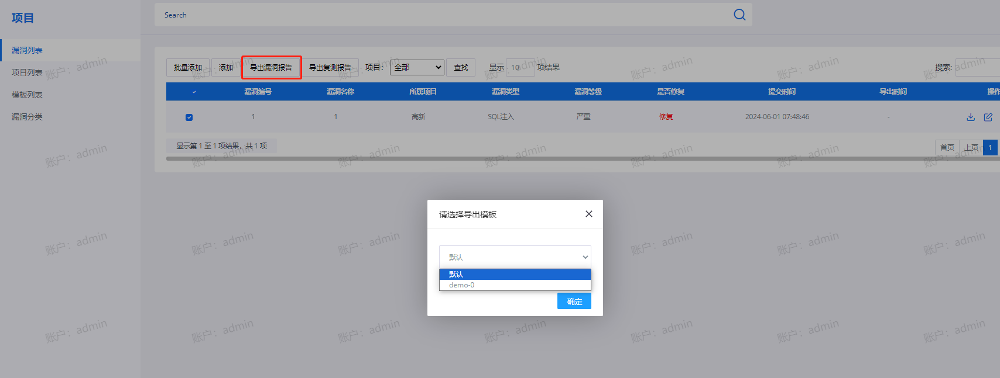
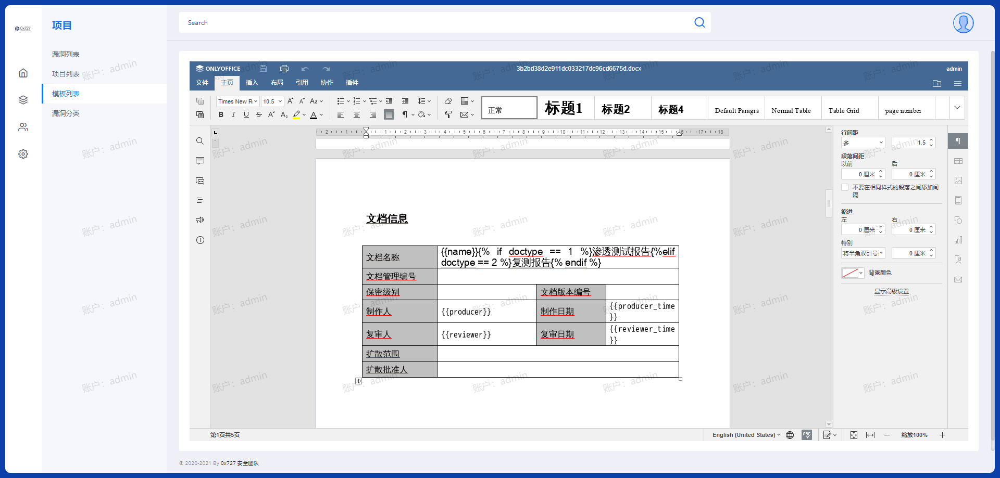
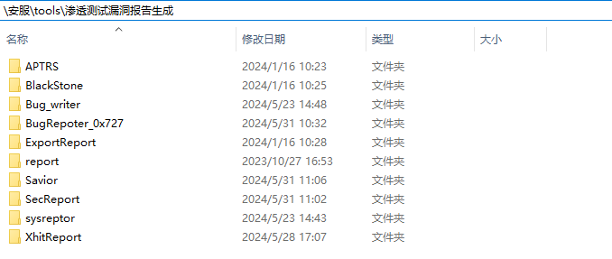

> ps: 创意阶段

# 简介

提速报告编写，全新自定义设计关键字的创新报告生成工具！

我们引入了一款让你报告编写事半功倍的创新工具。这个工具允许你自由设计报告模板，并根据需求自定义关键字，通过定位符将它们嵌入模板中。最终，工具会自动替换定位符，生成引人注目的完整报告。

无论你是渗透测试专家、网络安全从业者，或者是需要生成各种报告和文档的Web服务人员，这个工具都能完美满足你的需求。你可以轻松设计渗透测试报告、安全漏洞报告、性能测试报告、用户行为分析报告等等，只需简单操作，即可生成高效、准确、专业的报告。

通过这个工具，你将享受到报告编写的一致性、高效性和灵活性的巨大提升。告别繁琐的手工编写，让工具释放你的创造力，让你的报告在竞争中脱颖而出！

注：应用场景仅限于Web服务领域。

# 背景

一般来说渗透测试相关的报告分为几类

- 常见扫描器API/原报告(awvs、xray、goby)
- 各个公司自定义报告

- 各地市护网报告(每个地方的模板都不一样)

- 各SRC、众测、应急响应平台、CVE、CNVD等各类厂商报告
- 单个漏洞报告(以公司现在使用的为准)
- 内网总结报告(以公司现在使用的为准)
- 应急报告
- 分析报告
- 线索报告
- ......
- 等等

当不同类型的报告写得足够多时，就会逐渐形成一个完整规范的报告模板。这个模板通常会展现一些特征，包括：

- 结构化
- 标准化的语言和格式
- 可定制性

最重要的特征是结构化。一个规范的报告模板应该具有清晰的结构，按照一定的顺序组织各个部分的内容。这样做有以下几个重要的好处：

1. 提高可读性：结构化的报告模板可以使读者更容易理解和跟踪报告的内容。通过明确的章节划分和有序的信息排列，读者可以更快地找到感兴趣的部分，并更好地理解整体的报告概况。

2. 提供清晰的导航：结构化的报告模板可以提供目录和导航，使读者可以快速地浏览和导航到不同部分。这样读者可以根据自己的需求和兴趣，选择性地阅读特定的章节，而无需阅读整个报告。

3. 保证全面的覆盖：结构化的报告模板可以确保所有重要的内容都得到适当的涵盖。通过提供明确的章节和部分，报告模板可以促使报告作者在各个方面都进行全面的描述和分析，以确保报告的完整性。

4. 提高一致性和标准化：结构化的报告模板可以确保不同报告之间的一致性和标准化，使得不同报告之间更容易进行比较和对比。这有助于提高报告的可信度和可靠性，并为读者提供一个熟悉的框架来理解报告。

其次是标准化的语言和格式。在一个规范的报告模板中，使用统一的语言和格式是非常重要的，它有以下几个关键的好处：

1. 一致性：标准化的语言和格式能够确保报告的一致性，使得不同报告之间具有相似的风格和结构。这样，读者在阅读不同报告时，可以更容易地理解和对比各个部分的内容，而不需要适应不同的写作风格。

2. 易读性：标准化的语言和格式可以提高报告的易读性。通过使用清晰的段落和标题，以及适当的标点和格式，报告可以更容易被读者理解和消化。这有助于传达所要表达的信息，并提供良好的阅读体验。

3. 专业性：标准化的语言和格式可以增强报告的专业性。使用专业术语和行业惯例的统一语言，可以让报告更加准确和可信。同时，适当的格式和排版也可以增强报告的专业形象，并提升读者对报告的信任度。

4. 节约时间和努力：标准化的语言和格式可以节约撰写报告的时间和努力。通过使用已经定义好的语言和格式规范，报告作者可以更迅速地组织和编写报告的内容，而无需从头开始思考如何表达和组织信息。

但模板的核心是可定制性。在一个规范的报告模板中，可定制性是非常关键的，它具有以下几个核心的优势：

1. 适应性：可定制性使报告模板能够适应不同类型和需求的报告。用户可以根据具体情况选择性地添加、删除或修改模板中的部分，以满足特定报告的要求。这样，报告模板可以被广泛应用于各种情境和领域，提高了模板的灵活性和适应性。

2. 用户个性化：可定制性使用户能够个性化地定制报告模板，以展现自己的风格和要求。用户可以根据自己的喜好和偏好，调整模板的样式、排版、语言等方面，以使报告更符合个人或组织的品牌形象和要求。

3. 提高工作效率：可定制性使用户能够更高效地完成报告的撰写和编辑。通过定制化的模板，用户可以快速选择所需的部分和内容，无需从头开始构建报告的结构和格式。这样能够节省时间和精力，提高工作效率。

4. 统一性和标准化：可定制性可以确保报告的统一性和标准化。通过定义和应用一致的定制选项和规则，可以在不同报告中保持相同的结构、格式和语言风格。这有助于提高报告的一致性和可比性。

综上所述

- 结构化是一个报告模板中最重要和核心的特征。它能够提高可读性、提供清晰的导航、保证全面的覆盖以及提高一致性和标准化，使报告更加有效和可靠。

- 标准化的语言和格式是一个报告模板中最关键的特征。它能够确保报告的一致性、提高易读性和专业性，并节约时间和努力。这样的特征可以使报告更加规范、可信和高效。

- 而可定制性是报告模板的核心特点。它使报告模板具有适应性、用户个性化、提高工作效率以及统一性和标准化等优势。可定制性的存在使报告模板更加灵活、实用和适应不同用户和需求的要求。

# 场景

`结构化`和`标准的语言和格式`这两点就不多说，在创建模板的时候就会逐渐固定下来，只有`可定制性`是随着使用者的想法而不断改变。

这里以 [BugRepoter_0x727](https://github.com/0x727/BugRepoter_0x727) 项目举例，项目首页如下



开始根据内容添加漏洞，这些都是根据`关键字`进行定位



数据库相应的关键字



接着导出该报告，这里的报告使用了`docx模板`，并将上面`关键字`对应的内容替换到模板中



查看`默认模板`, 存在一些设计的`关键字`



对于这种项目，无论是在代码还是数据库方面，已经固定了模板和关键字。如果想要按照自身的模板生成报告，就需要对代码和数据库进行相应调整，以适应特定的要求。

然而，这种调整仍然只能适用于一个文档。如果有新的报告需求，就需要再次进行调整和二次开发。这导致了这类项目的难度较大，适用范围相对较窄。




许多类似的工具都存在`二次开发难度高`和`关键字固定`的问题。这些工具通常基于特定的模板和关键字来生成报告或文档。因此，如果想要适应不同的需求或进行个性化定制，就需要进行复杂的二次开发和调整工作。


# 突破

这些问题限制了这类工具的适用范围，无法灵活地满足各种情况下的需求。

为了解决这个问题，可以考虑开发一种更加灵活和可定制的工具。该工具应该允许用户根据自己的需求自定义模板和关键字，以提高工具的适用性和扩展性。在开发过程中，需要充分考虑各种需求，并提供相应的接口和功能，以支持用户的个性化定制。

这里以 [BugRepoter_0x727](https://github.com/0x727/BugRepoter_0x727) 项目举例，有两个模糊的思路

## 思路一

开始根据内容添加漏洞，这些都是根据`关键字`进行定位，可以在顶部添加一些功能，类似`word的插入功能（如新建关键字、插入文本框、插入编辑框、插入多选框、插入下拉框）等等`


接着设计模板，通过将关键字与模板文件中的特定位置一一对应，可以实现更灵活的内容生成。

在进行模板设计时，可以创建一个Word模板文件，将关键字的位置作为占位符，如{{关键字}}。然后，使用编程语言或工具，将关键字逐一替换为实际的内容。

例如，如果有一个关键字"{{producer}}"，可以在模板文件中使用占位符`{{producer}}`。在生成文档时，通过读取关键字和对应的内容，将"{{producer}}"替换为实际的`制作人`描述。


## 思路二

与上面的方案正好相反，也是我现在使用的方法

可以先上传模板文件，并确保模板中使用了准确、特定、能够定位的占位符，如

```{{关键字}}、#关键字#
{{关键字}}
#关键字#
[关键字]
<关键字>
【关键字】
@关键字@
%关键字%
~关键字~
$关键字$
*关键字*
|关键字|
```


然后扫描模板，根据关键字自动生成插入界面

接着改变关键字对应的的输入类型，如文本框、编辑框、多选框、下拉框等等


理论上来说，这两个思路应该是同一方案的不同实现方法，难点还是在`关键字的插入和应用`这一块。

## 思路三

关键字的模块设计：动态插入管理数据

数据导出：不限制内容格式，导出任意文件

模板导出：导入根据关键字组成的模板文件，根据模板导出

# 延申

上面所提到的仅仅是单方面的功能，除了报告生成功能，这个工具还可以进一步扩展和完善其他功能。

- 自动化报告生成：除了自定义设计关键字的报告生成，可以引入自动化的报告生成功能。通过与相关数据源的集成，工具可以自动收集和分析数据，并生成相应的报告。例如，从漏洞扫描工具获取漏洞信息，从性能测试工具获取性能数据等。
- 数据可视化与报表：为了更直观地呈现报告内容，可以引入数据可视化和报表功能。这样，用户可以通过图表、图形和表格等方式展示数据，更清晰地理解和分析结果。同时，还可以提供导出报表的功能，以便用户可以轻松地与他人共享和汇报数据。
- 多模板管理：为了满足不同类型报告的需求，可以提供多模板管理功能。用户可以根据不同的报告类型，选择适合的报告模板进行使用。这样，工具可以根据用户选择的模板，定位关键字并生成相应的报告。
- 时间追踪与提醒：为了更好地管理项目和工作进展，可以引入时间追踪和提醒功能。用户可以记录和跟踪任务的时间消耗，设置提醒以及设定截止日期等功能，以便及时完成工作和提高工作效率。

- 团队管理与统计功能。可以帮助团队协作和监控工作进展。例如，可以实现用户管理、权限分配、任务分配和进度跟踪等功能，以便团队成员之间的有效协作和沟通。同时，还可以提供统计报告，以便团队领导或项目经理可以了解团队成员的工作状态和绩效。

- 漏洞管理与统计功能。可以帮助用户更好地管理和跟踪发现的漏洞。通过记录和跟踪漏洞的详细信息、优先级和解决进度，用户可以更有效地组织和处理漏洞修复工作。此外，还可以提供漏洞统计报告，以便用户可以了解漏洞的分布情况、类型和修复效率。

- 项目管理与统计功能。可以帮助用户更好地管理和监控渗透测试项目。通过记录和跟踪项目的进度、资源分配和时间安排，用户可以更好地掌握项目的整体情况，并进行合理的调度和决策。此外，还可以提供项目统计报告，以便用户可以了解项目的完成情况、成本控制和质量评估。

通过这些功能的扩展和完善，这个工具将能够满足更广泛的需求，并为用户提供更全面、高效的工作支持。不仅可以生成报告，还可以提供团队协作、漏洞管理和项目管理等方面的支持，提升工作效率和管理能力。

# 总结

- 本项目旨在实现一个自定义设计关键字的报告生成工具，根据模板中的定位符来定位关键字并生成完整的报告。

- 通过这个工具，用户可以根据自己的需求和模板设计，自定义关键字，并使用特定的定位符将关键字嵌入到模板中。然后，工具会根据模板中的定位符，定位关键字的位置，并将其替换为实际内容，生成完整的报告
